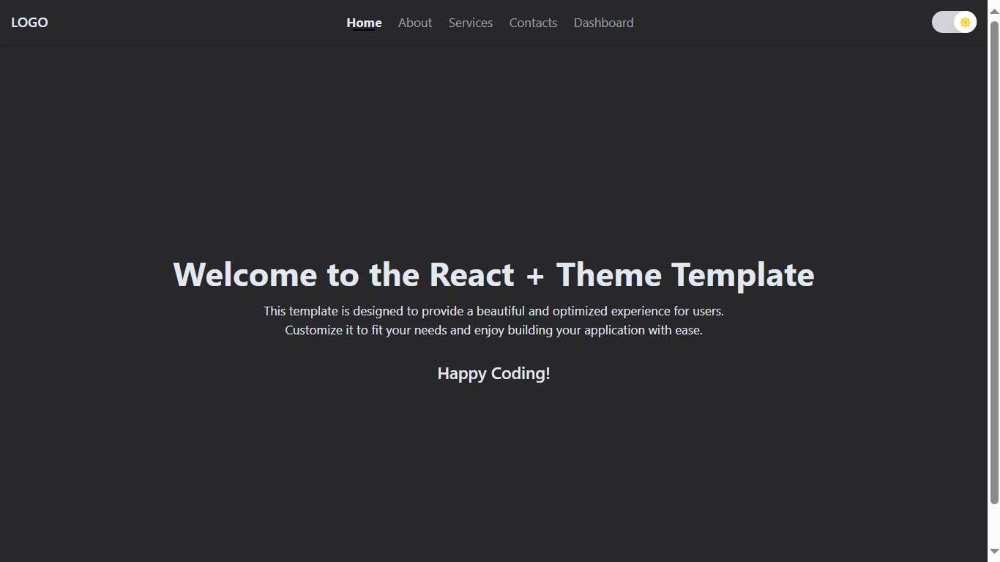
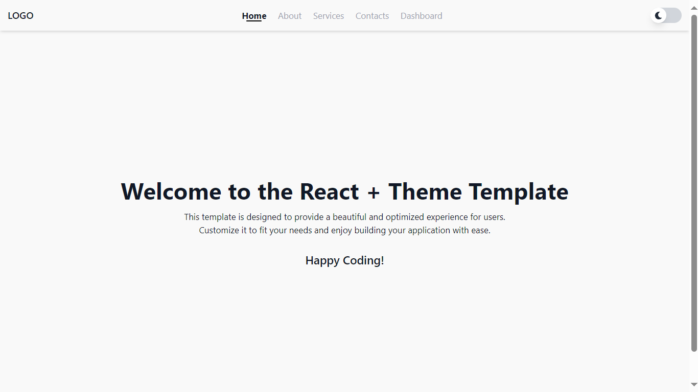
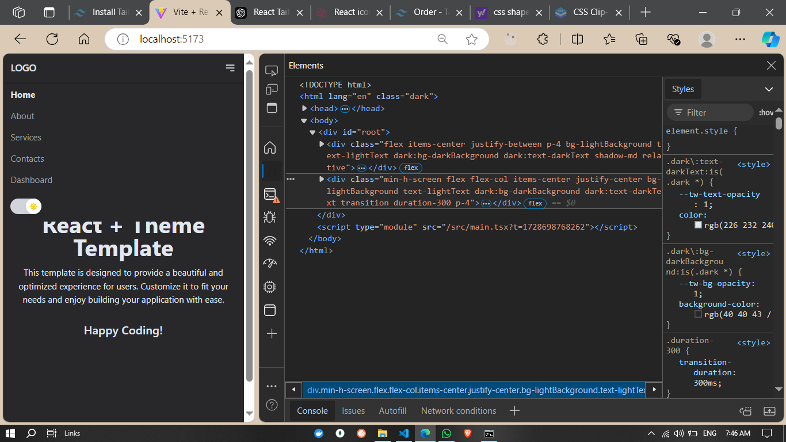

# React Theme Provider Template

This is a **React** template designed to provide a beautiful and optimized experience with both dark and light themes. The structure allows for easy customization and scalability.

## Features

- **Dark and Light Theme Support**: Easily switch between dark and light themes.
- **Responsive Design**: The layout adapts to different screen sizes.
- **Optimized for Performance**: Efficient rendering for a smooth user experience.
- **Easy Setup**: Get started quickly with minimal configuration.

## Images

### Dark Mode

### Light Mode

### Responsiveness

    
